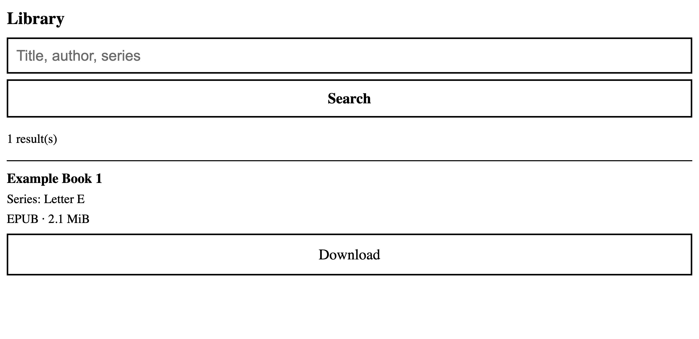

# komga-ereader-page

Tired of horrible browser support on your e-reader? Cant even visit your komga instance? Simply want to download your books which already in your komga. Then this is for you!

A tiny e-reader-friendly front end for [Komga](https://komga.org): search your library and download books from a browser with no JavaScript (tested target: Tolino Shine 5). Plain server-rendered HTML, black on white, huge tap targets, no images or external assets. Single static Go binary, ~6 MB Docker image.



The Komga API key stays server-side; it never appears in HTML or URLs. The app has **no login of its own**. Put it behind a reverse proxy with auth (Authelia, basic auth, VPN).

## Configuration

| Variable        | Required | Description                                     |
| --------------- | -------- | ----------------------------------------------- |
| `KOMGA_URL`     | yes      | Komga base URL, e.g. `http://192.168.1.10:8091` |
| `KOMGA_API_KEY` | yes      | Komga API key (sent as `X-API-Key`)             |
| `PORT`          | no       | Listen port, default `8080`                     |

Create a key in Komga under _Account settings → API Keys_. See [.env.example](.env.example).

## Run

```sh
docker build -t komga-ereader-page .
docker run -d --name komga-ereader-page --restart unless-stopped \
  -p 8094:8080 \
  -e KOMGA_URL=http://192.168.1.10:8091 \
  -e KOMGA_API_KEY=your-key \
  komga-ereader-page
```

Or `cp .env.example .env`, edit, then `docker compose up -d`. Without Docker: `go run .` with the env vars set.

## Reverse proxy

[deploy/traefik.example.yml](deploy/traefik.example.yml) has a Traefik example for `books.example.com` (edit the host) with Authelia `forwardAuth`, plus a commented basicAuth alternative.

## Test it

```sh
# health
curl -i http://localhost:8094/healthz
# search page (HTML list with Download links)
curl -s 'http://localhost:8094/?q=dune' | grep -o 'href="/download/[^"]*"'
# download (replace ID with one from above); check headers and file
curl -sD - -o /tmp/book.epub http://localhost:8094/download/ID | grep -iE 'HTTP/|content-(type|disp)'
file /tmp/book.epub
# the key must never leak
curl -s 'http://localhost:8094/?q=dune' | grep -c "$KOMGA_API_KEY"   # expect 0
# bad id -> 400
curl -i http://localhost:8094/download/..%2Fetc
```

## Develop

```sh
go test ./...
```

See [CONTRIBUTING.md](CONTRIBUTING.md). Licensed under [MIT](LICENSE).
